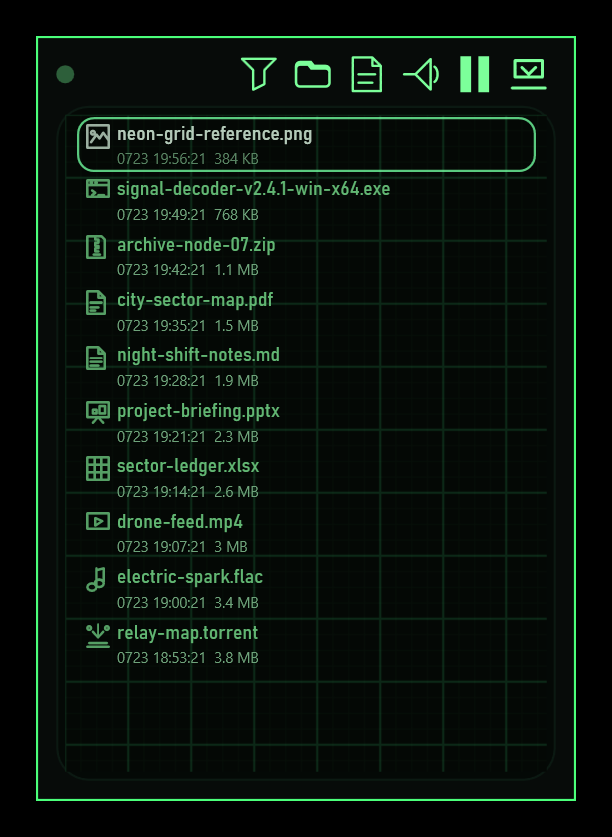

# Voltura Download Watcher

<p align="center">
  
</p>

A minimal .NET 10 Windows panel for live Downloads activity. It keeps short-lived downloads visible even when another app immediately removes them, shows browser download progress, opens files with the Windows shell, and stays available as a compact always-on-top panel or tray app.

Safe Recycle Bin deletion, direct-delete opt-out, optional sound/startup behavior, adaptive file sizes, and a daily activity log are built in without stock Windows UI chrome.



## Highlights

- Borderless, resizable, always-on-top WPF panel with a compact cyberpunk blueprint UI.
- Shows the latest 20 downloads with compact timestamps and adaptive file sizes, and marks removed files without launching dead paths.
- Detects browser staging activity without listing temporary `.crdownload`, `.part`, `.partial`, or `.download` files.
- Single-click shell opening, themed file deletion, tray controls, optional startup registration, and optional download sound.
- Recycle Bin deletion by default, with a direct-delete opt-out and a daily activity text log that identifies app versus external removals.
- Single-instance activation brings the existing watcher forward instead of opening another panel.

## Develop

Requires the .NET 10 SDK on Windows.

```powershell
dotnet test .\VolturaDownloadWatcher.Tests\VolturaDownloadWatcher.Tests.csproj --configuration Release
dotnet run --project .\VolturaDownloadWatcher\VolturaDownloadWatcher.csproj
```

## Branding

The repository uses PowerShell jobs rather than npm as a task runner:

```powershell
.\scripts\generate-icon.ps1
.\scripts\generate-installer-images.ps1
.\scripts\capture-app-screenshot.ps1
.\scripts\generate-branding.ps1
```

Screenshot capture launches an isolated demo mode at `0,0`, renders only fictional filenames, and composites the translucent UI onto black. It never enumerates the real Downloads folder.

## Package

NSIS is discovered from `PATH` or its standard Program Files locations. Packaging produces a small framework-dependent installer and a full self-contained installer:

```powershell
.\scripts\package-win.ps1
```

Outputs are written to `artifacts\publish`. Release details are in [docs/release.md](docs/release.md).

## Trust And Distribution

Voltura Download Watcher is freeware from Voltura AB and is open source under the [MIT License](LICENSE). It can be used without payment, registration, trial limits, or feature locks.

Release binaries are currently not code-signed. Windows can therefore show an unknown-publisher or Microsoft Defender SmartScreen warning. Download only from the [official GitHub releases](https://github.com/voltura/voltura-download-watcher/releases/latest).

## Commands

```powershell
# Build or run the app under the Debug configuration
.\scripts\build.ps1
.\scripts\build.ps1 -Configuration Debug
.\scripts\run-debug.ps1

# Test and regenerate visual assets
dotnet test .\VolturaDownloadWatcher.Tests\VolturaDownloadWatcher.Tests.csproj --configuration Release
.\scripts\generate-branding.ps1

# Build both local NSIS installers
.\scripts\package-win.ps1

# Advance 0.1.9 -> 0.2.0, or prepare an explicit version
.\scripts\bump-release.ps1
.\scripts\prepare-release.ps1 0.2.0

# Push a prepared version; GitHub Actions creates a draft release
git add .
git commit -m "Release 0.2.0"
git push origin main

# Optional manual retry and draft inspection
gh workflow run release.yml
gh release list --repo voltura/voltura-download-watcher
```

Automatic releases only react to a changed `<Version>` in `VolturaDownloadWatcher.csproj`. GitHub Actions tests the app, builds the small and full NSIS installers, and leaves the release as a draft for manual notes and publication.

The Pages workflow publishes this README as the project site at `https://voltura.github.io/voltura-download-watcher/`; no separate website source or hosting is required.

## Optional Support

- [Ko-fi](https://ko-fi.com/voltura)
- [PayPal](https://www.paypal.me/voltura)

## Statistics

[](https://github.com/voltura/voltura-download-watcher)
[](https://github.com/voltura/voltura-download-watcher/stargazers)
[](https://github.com/voltura/voltura-download-watcher/forks)
[](https://github.com/voltura/voltura-download-watcher/commits)
[](https://github.com/voltura/voltura-download-watcher)
[](https://github.com/voltura/voltura-download-watcher)
